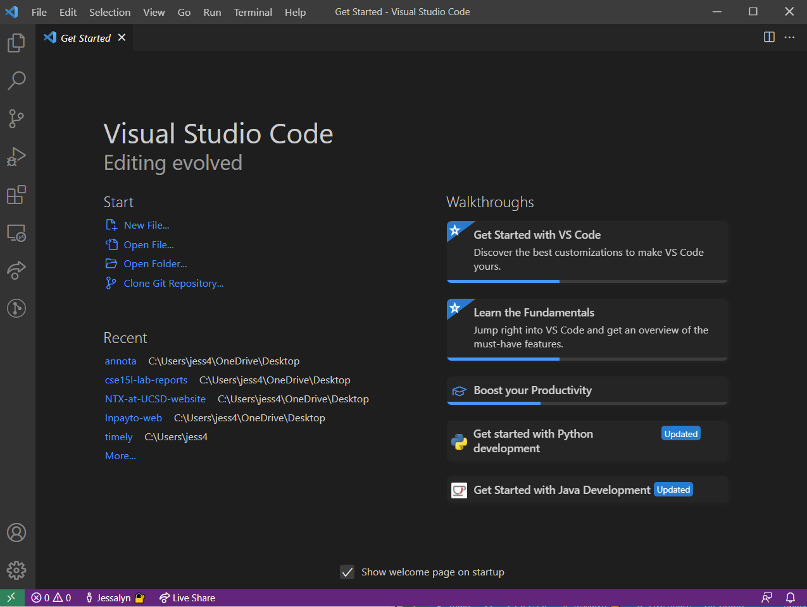
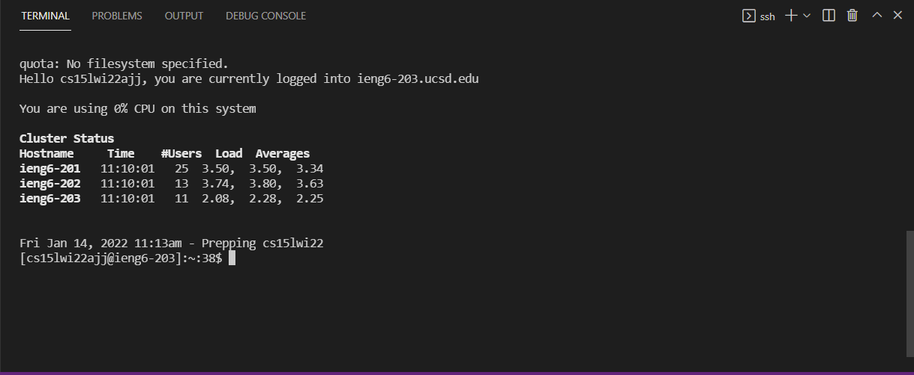
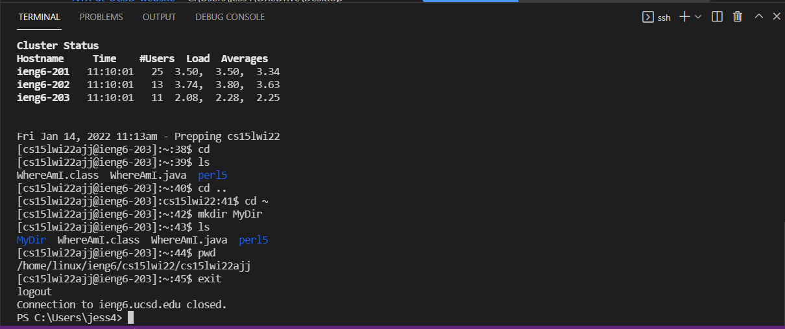
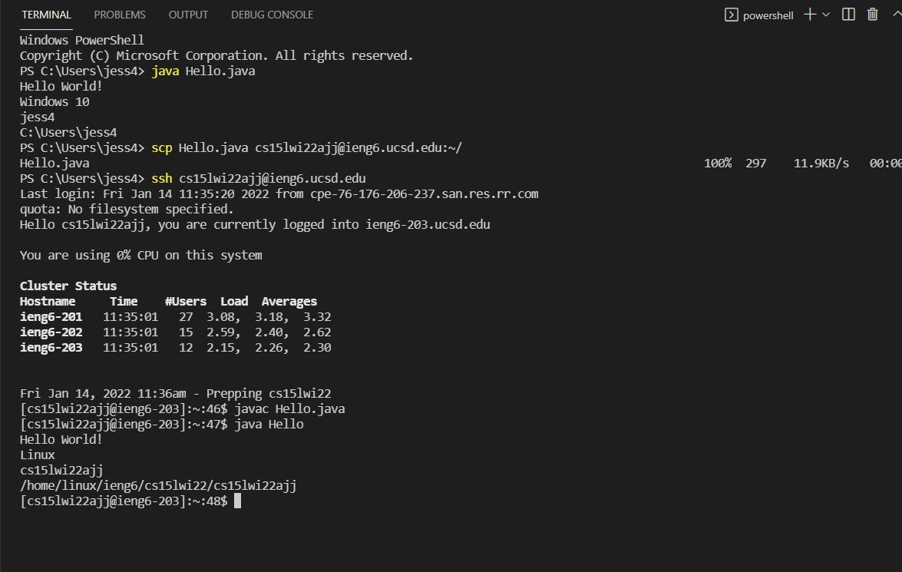
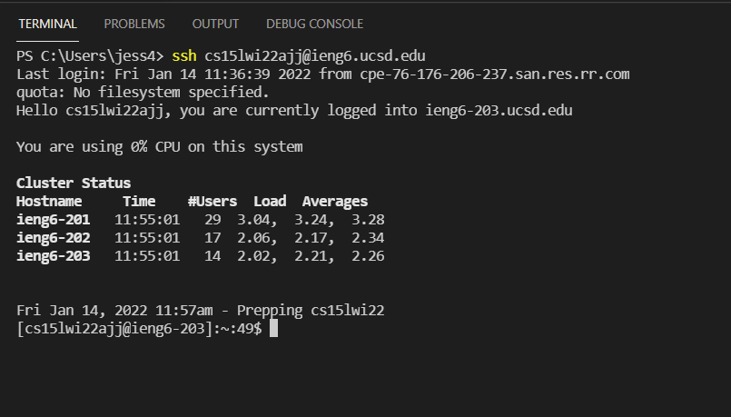

# Lab Report 1

This lab report will cover remote access. We will begin by learning how to install popular code editor VS Code, and end being able to access and interface with course-specific accounts on `ieng6`.

## Part 1: Installing VS Code



Here are the steps for installing VS Code. Once completed, you should see something similar to the image above.

1. If you only have access to a tablet or Chromebook, you will not be able to install.
2. Otherwise, go to this [link](https://code.visualstudio.com/) and follow the instructions
3. Once it is installed, you should be able to open VS Code and see something similar to the image above. It might have different colors or less widgets on the sidebar, but that is okay!

## Part 2: Remotely Connecting

1. If you are on Windows, install a program called OpenSSH through this [link](https://docs.microsoft.com/en-us/windows-server/administration/openssh/openssh_install_firstuse)
2. Then, look up your course specific account and make sure to change the password if it has not already been activated here: [https://sdacs.ucsd.edu/~icc/index.php](https://sdacs.ucsd.edu/~icc/index.php)
3. Then, open VS Code and open a terminal by going to Terminal -> New Terminal in the menu, or using Ctrl/Command `.
4. Next, use the command `ssh <account_username>@ieng6.ucsd.edu`, say yes to the message, and log in using the password you set
5. Now, your terminal should be connected! You should see something similar to the image below



## Part 3: Trying Commands

Now that you have access to the remote server, you can try running some commands! Try running the commands `cd`, `ls`, `pwd`, `mkdir`, `cp`, and `exit` a few times on the remote computer as well as your own to see what the differences are. Additionally, see if you can figure out what each command means and how it best should be used. An example of some of the commands run on the remote computer is below.



## Part 4: Moving Files with scp



Now, we will learn how to move commands with `scp`. Once you are done, your terminal should look something similar to the image above.

1. On *your* client, make a file called `Hello.java` and copy the following code into it:
```
class Hello {
    public static void main(String[] args) {
        System.out.println("Hello World!");
        System.out.println(System.getProperty("os.name"));
        System.out.println(System.getProperty("user.name"));
        System.out.println(System.getProperty("user.dir"));
    }
}

```
2. Run the file using javac and java on your computer, and note what you see. Then, move the file with the command `scp Hello.java <account_username>@ieng6.ucsd.edu:~/`
3. Next, log into the remote computer and run the file again. Your output should be different! Now, you know how to move files using the `scp` command

## Part 5: Setting an SSH Key

Next, we will learn how to set up an SSH key. This will allow you to bypass using a password when using `ssh`.

1. On your computer, run `ssh-keygen` if you do not already have a key generated and follow all the prompts.
2. If you are on Windows, you can follow the extra steps [here](https://docs.microsoft.com/en-us/windows-server/administration/openssh/openssh_keymanagement#user-key-generation)
3. The command should have made two files, `id_rsa` and `id_rsa.pub` make sure these are in the `.ssh` file of your computer and move them there if they are not
4. Now, we copy the public key onto the remote computer. Log into the remote computer and make a directory called `.ssh`
5. Exit back into your client, and use `scp` to copy using the command `scp <path_to_your_public_key> <account_username>@ieng6.ucsd.edu:~/.ssh/authorized_keys`. You should now be able to log into the remote computer without a password prompt! Logging in will look something like the image below



## Part 6: Optimizing Remote Running