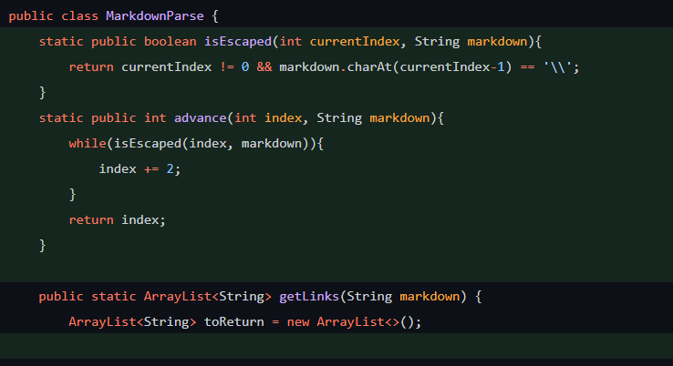
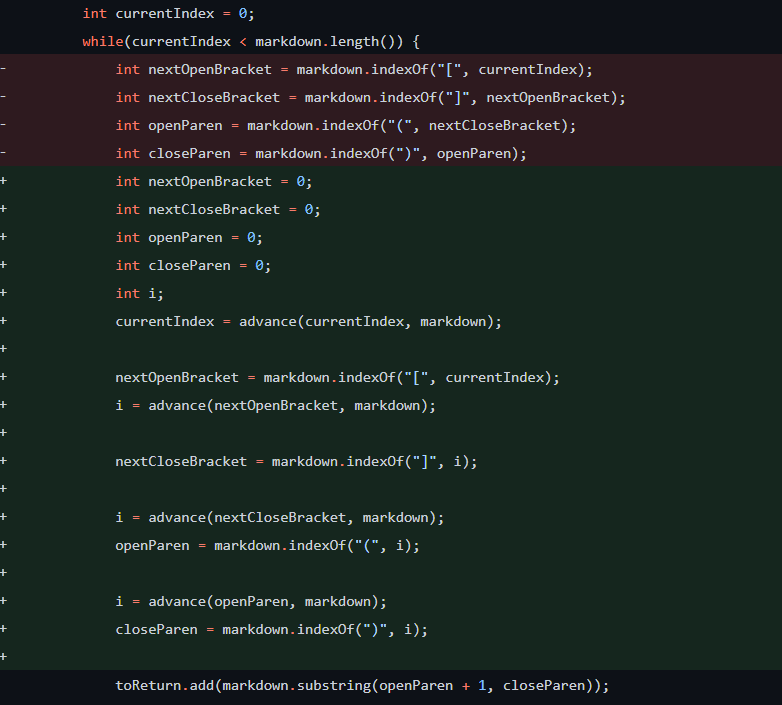
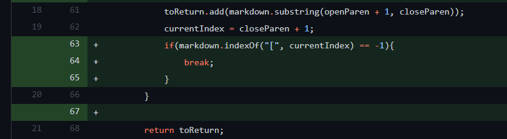
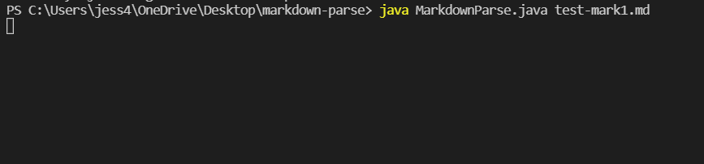
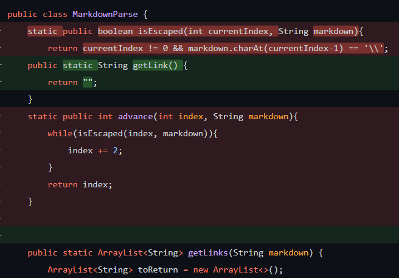
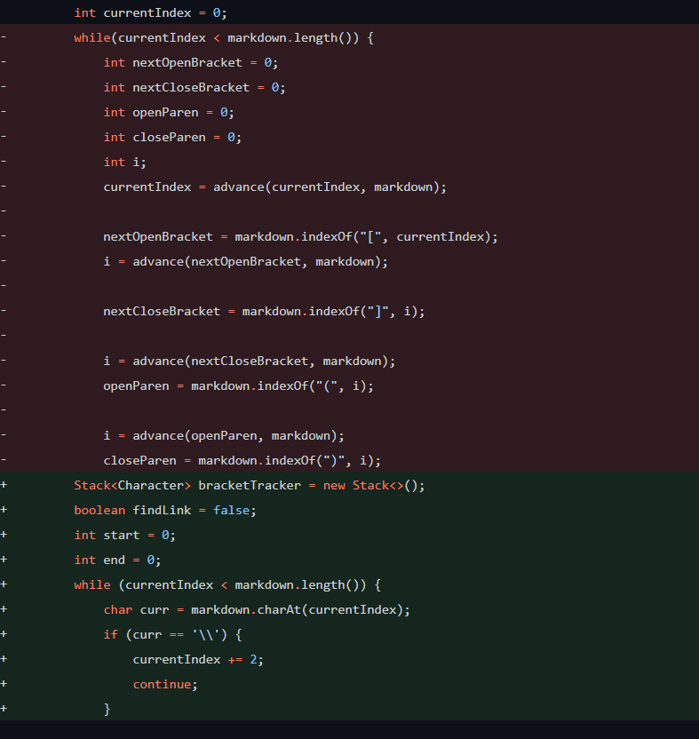
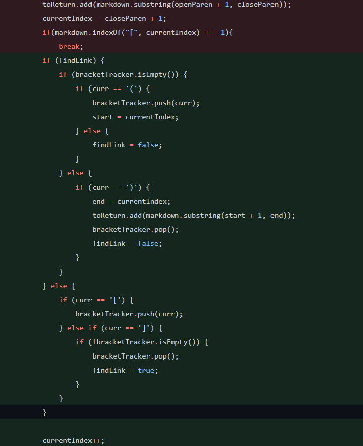
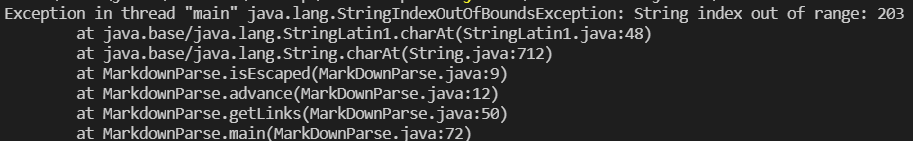
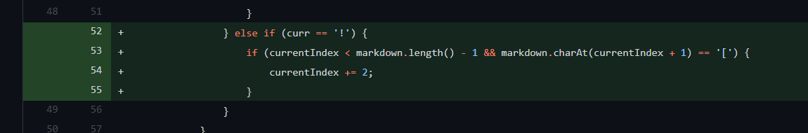
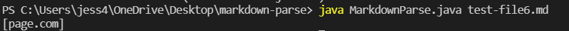

# Lab Report 2

This lab report will cover bug finding and fixing.

## Selected Change 1:

The first change we made was by reworking the way we looked for links. In the original code, files had to end in a link due to the issue that the the search for link only ended if position of the closing parentheses of the last link was at the last character of the file. The code change is below.

Below is the failure inducing input that prompted the change:

And the link to the test file that caused it:

[Test File 1](https://github.com/JessalynWang/markdown-parse/blob/main/test-mark1.md)

The symptom of the bug was an infinite loop.

The bug was that in the original while loop, we were only exiting the loop if the ending parentheses of the last link was also the last character of the file. The failure inducing input was adding non-link related text after the file. The symptom of the failure inducing input caused by the bug was an infinite loop.

## Selected Change 2:

The second change we made was by reworking the way we managed escape characters. We handled them before by advancing extra indices, but there was a bug that caused index out of bounds errors. The code change is below.

Below is the failure inducing input that prompted the change:

And the link to the test file that caused it:

[Test File 2](https://github.com/JessalynWang/markdown-parse/blob/main/test-mark2.md)

The symptom of the bug was an `IndexOutOfBoundsException`.

The bug was that in the case that there was a valid `\` character followed by a `[` on the last line, the advance function would tag it as something that needs to be advanced when it really isn't. Then, the advance function would increase the index too far and thus looking for the subsequent closing bracket would result in a -1 one index, which would cause an out of bounds error when put through the advance function. The failure inducing input was adding a valid `\` followed by a `[` at the end of the file. The symptom of the failure inducing input caused by the bug was an index out of bounds error.

## Selected Change 3:

The third change we made was by adding an edge case for looking for links. The function was detecting images as links. The code change is below.

Below is the failure inducing input that prompted the change:

And the link to the test file that caused it:

[Test File 6](https://github.com/JessalynWang/markdown-parse/blob/main/test-file6.md)

The symptom of the bug was a detected link where there shouldn't have been one.

The bug was that in images have a similar syntax as links, but have an exclamation point in front, and we did not account for that. Thus, we detected them as links. The failure inducing input was adding an image to the file. The symptom of the failure inducing input caused by the bug was the program detecting an image and outputting the url of the image as a link.

