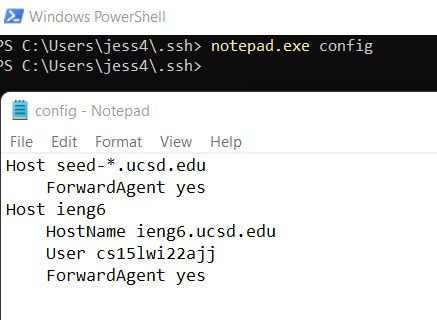
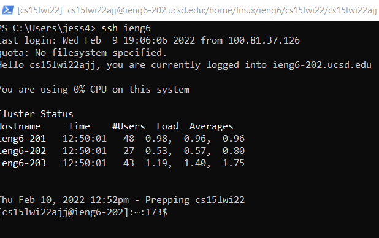
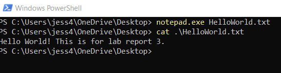
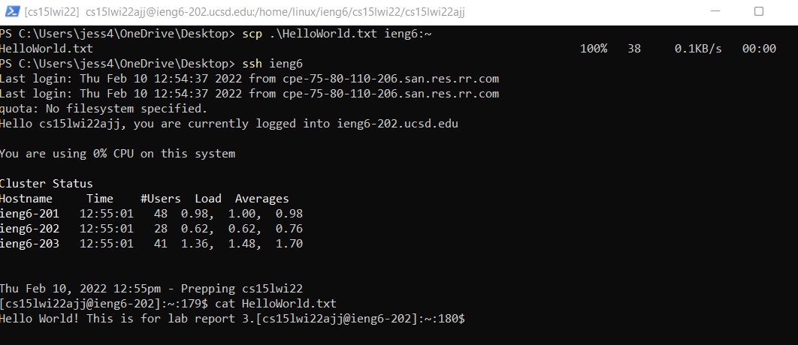

# Lab Report 3

This lab report will cover how to streamline ssh condifguration.

## Step 1: Create and Edit Config File

Navigate to the .ssh folder and create a new file called `config`. I used the `notepad.exe` command to create it, but there are other opsion such as `vim` or using a code editor. Then, add the following contents to the file:

```
Host ieng6
    HostName ieng6.ucsd.edu
    User cs15lwi22zzz (use your username)

```

An example is shown below.



## Step 2: Log in to ieng6 with the new alias

Using the alias ieng6, run the command `ssh ieng6` you should be able to log in now. An example output is shown below. The alias is set with whatever we decide to call the Host. If the `Host ieng6` line was changed to `Host ieng7` for example, ssh-ing would be done with `ssh ieng7` instead.



## Step 3: Scp with the new alias

The `scp` command can also be used with the new alias. To test this out, first create a file. An example is shown below.



Next, use the `scp` command to move the file with `ieng6` as the remote server we want to copy the file to. The file should now be discoverable in the file system on the ieng6 server. An example is below.



