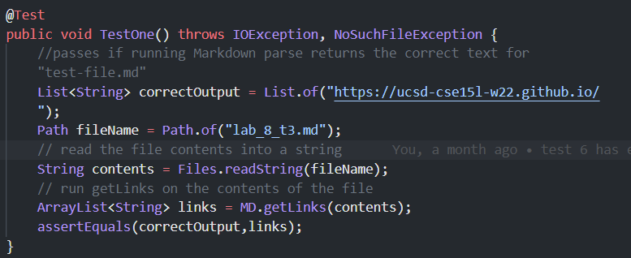

# Lab Report 4

This lab we will run some tests on two versions of markdown parse code. [My version](https://github.com/JessalynWang/markdown-parse) | [The version I reviewed](https://github.com/BasilThaddeus/markdown-parse)

## Test 1

Based on the markdown preview, the expected output is ``[`google.com, google.com, ucsd.edu]``

The file as turned into a test as follows: 

### My Code

My code did not pass, the failure output is below.

### Reviewed Code

The reviewed code did not pass, the failure output is below.

## Test 2

Based on the markdown preview, the expected output is ``[a.com, a.com(()), example.com]``

The file as turned into a test as follows: 

### My Code

My code did not pass, the failure output is below.

### Reviewed Code

The reviewed code did not pass, the failure output is below.

## Test 3

Based on the markdown preview, the expected output is ``[https://ucsd-cse15l-w22.github.io/]``

The file as turned into a test as follows: 

### My Code

My code did not pass, the failure output is below.

### Reviewed Code

The reviewed code did not pass, the failure output is below.

## Questions

### Snippet 1

My code: I think there would be a less than 10 line change that would allows my output to match the expected. I would change the behavior of checking for closing braces such that isntead of making sure the next character is an opening brace, i would check if the previous character was a closing brace, which would be about a one line change. Then, I would check for incomplete backticks when idenitfying links which would also be a couple lines.

The reviewed code: I think the reviewed code could also make the change in < 10 lines. I think they would just have to make sure that there isnt a lingering open backtick when finding the closing hard bracket.

### Snippet 2

My code: I think my code needs a more involved fix. I need to iterate until either multiple spaces before a non ) character or a new line is detected or I find the last parenthesis on the line, and there are nuances to when a new line isn't counted as a link and when it is that I would need to account for.

The reviewed code: I think the reviewed code would also need a more involved fix for the same reasons. There are many nuances regarding spaces and new lines it doesn't account for. It also does not account for escaped braces, but the test was not comprehensive enough to detect that.

### Snippet 3

My code: I think my code needs a more involved fix, because there are many different scenarios that arise regarding spaces and new lines, and it would take more than ten lines of code to account for that.

The reviewed code: I think the reviewed code would also need a more involved fix for the same reasons. There are a lot of different cases and scenarios taht arise regarding new lines and long texts and links, and it would take more lines of code to account for that.

