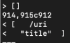
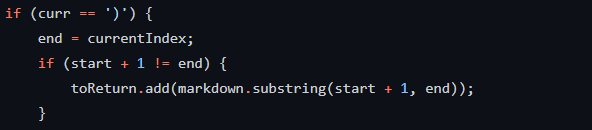
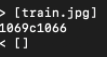
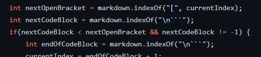

# Lab Report 5

This lab we will run more tests on two versions of markdown parse code. I wrote the outputs of the two programs into a file and used diff to find the differences between the tests. 

## Test 1

The first test differed as follows:

The first output is the output from the other implementation, and the second is the output from ours. In this case, neither output is correct. The file should output `\uri` instead of what both outputs are.

For our implementation, the bug is that we are not differentiating between the link destination and the optional title, and output the whole string instead. This could be fixed by detecting spaces and new lines to differentiate arguements, and making sure the optional title is in quotations. The code that should be fixed is below. Here, once we have found the indexes of what could be a link, we should do some processing to figure out if it is actually a link and how much of it to keep.

## Test 2

The second test differed as follows:

The first output is the output from the other implementation, and the second is the output from ours. In this case, our output is correct. The file should output `[]` instead of what the other implementation outputs since `train.jpeg` is an image, not a link.

For the provided implementation, the bug is that it is not differentiating between images and links. This could be fixed by checking for the presence of ! before the open bracket of a potential link. The code that should be fixed is below. When we an exisitng next open bracket, we can check the character before it to see if it is a link, although we would also have to make sure any ! before the [ is not escaped.

